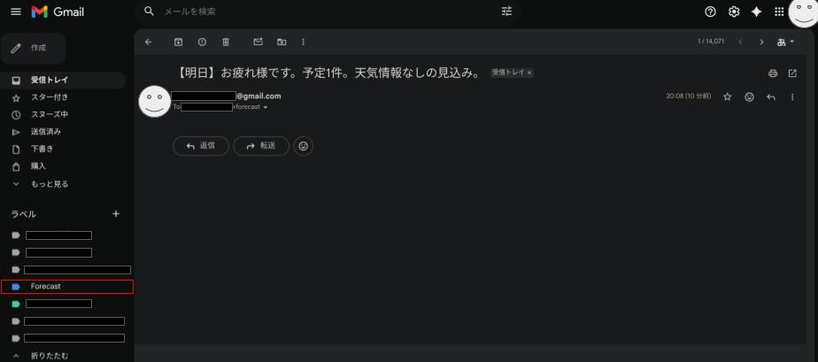

# Survival DX Calendar Notifier (ゼロタップ通知システム)

> **「我らは忍。質素に生きること。無駄を削ぎ落とすこと。」**

`survival-dx-calendar-notifier` は、情報のインプットにかかる「視覚的な手間」と「認知負荷」を極限まで削ぎ落とした、Google Apps Script (GAS) ベースの通知システムです。

Google カレンダーから予定と天気（降水量）を取得し、**「メールの件名だけ」**ですべてを完結させることで、スマホの通知画面をチラ見するだけの「ゼロタップ」な情報収集を実現します。

---

## 💡 コンセプト：Survival DX（究極の引き算）

現代のIT活用は、多機能化という名の「情報の過剰」に陥りがちです。
本プロジェクトでは、あえて「リッチなUI」や「音声生成API」といった装飾を排除し、OS標準のプッシュ通知という最も堅牢で軽量なインターフェースを使い倒します。

- **ゼロタップ体験**: アプリを開く、再生ボタンを押すといった1アクションすら不要。
- **外部依存ゼロ**: LINE APIやGCP APIを介さず、Googleエコシステム内だけで完結。
- **管理コスト最小化**: Gmailエイリアス機能を活用し、新規アカウント作成不要で自動仕分け。

---

## ✨ 主な機能

- **スマートな予定抽出**: 朝（今日）と夕方（明日）で取得対象を自動切り替え。
- **天気データ連携**: カレンダー上の降水量データ（Yahoo!/OpenWeather等）を自動パース。
- **自動トリガー設定**: スクリプト内の関数一つで、定時実行タイマーを自動構築。
- **情報の超圧縮**: 20〜30文字の「件名」に必要な情報をすべて凝縮。

---

## 🚀 セットアップ

### 1. 準備
- Google カレンダーに、名前に `Forecast` を含む天気情報用カレンダーを連携させておいてください。
- 自身のGmailアドレス（または `example+forecast@gmail.com` のようなエイリアス）を用意します。

### 2. スクリプトの配置
1. [Google Apps Script](https://script.google.com/home) で新しいプロジェクトを作成します。
2. `src/code.gs` の内容をエディタに貼り付けます。
3. `MY_EMAIL` の値を自身のアドレスに変更します。

### 3. 自動設定
1. GASエディタの関数選択から `setupTriggers` を選択して実行します。
2. 権限の承認を済ませれば、毎日 6:00 と 18:00 に自動的に通知が届くようになります。

---

## 🛠️ 技術的な仕組み

### 配列操作と正規表現による圧縮
`filter()` と `includes()` を活用し、複数のカレンダーから必要な情報を高速に抽出。不要な「【予報】」や「[Yahoo]」といった文字列を `replace()` で削ぎ落とします。

### 自動トリガー管理
`ScriptApp.newTrigger()` をコード内で記述することで、UIからの手動設定を不要にしています。これにより、環境移行時の再現性を高めています。

---

## 👤 開発者

**伊藤 正章 (Masaaki Itoh)**
- **Branding**: [Shinobi / Survival DX]
- **note**: [masa_cloud](https://note.com/masa_cloud)
- **YouTube**: [@hack-ninja](https://youtube.com/@hack-ninja)
- **GitHub**: [Masaaki-jp](https://github.com/Masaaki-jp/)

---

## 📜 ライセンス

[MIT License](LICENSE)
